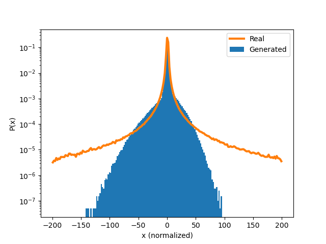
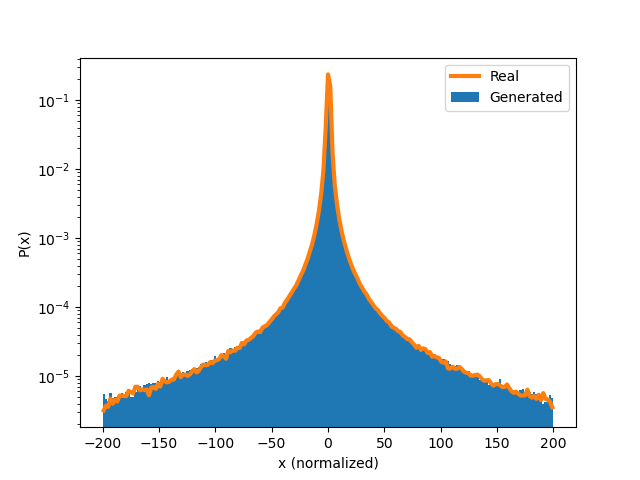

# Modifications to Pareto GAN

Modifications are made to the original Pareto GAN code which supports [this paper](https://doi.org/10.48550/arXiv.2101.09113).

Pareto GAN shows that a GAN cannot generate data with heavy tails than the latent space follows a light-tailed distribution (such as Gaussian). This paper ([and many others](https://doi.org/10.48550/arXiv.2504.21438)) make changes to the architecture and training procedure to improve training on heavy-tailed data.

This repo investigates whether a simpler method can achieve similar results. Specifically, transforming training data to a Gaussian distribution before training as normal, then transforming back to the original distribution. We call this method `cauchy2gaussian`.

Even though the training data is a mixture of Cauchy distributions, we find that fitting another Cauchy distribution to the mixture provides adequate results. This indicates that the method may still be suitable for data composed of a mixture of unknown heavy-tailed distributions, provided the fitted distribution provides a reasonably good approximation. 

## Results

<figcaption>**Histograms left to right**: `normal`, `pareto`, `cauchy2gaussian`</figcaption>


| Experiment     | KS Statistic | Log-Log Area |
|----------------|--------------|---------------|
| `normal`         | 0.0332       | 52.35         |
| `pareto`         | 0.0123       | 1.97          |
| `cauchy2gaussian`| 0.00637      | 20.50         |


# Pareto GAN

## Install dependencies
```
pip install torch numpy matplotlib pandas scipy
```
Note: we recommend installing torch with GPU support

## Run an experiment
```
python exps.py -ds 0 -type normal
python exps.py -ds 0 -type pareto
python exps.py -ds 0 -type cauchy2gaussian
```

## Options
GAN type (-type): 
 * pareto
 * uniform
 * normal
 * lognormal

Dataset (-ds): 
 * 0: Dual Cauchy

Note: real datasets may not be available anymore. Dual Cauchy is a good "dataset" to illustrate the concept. 
